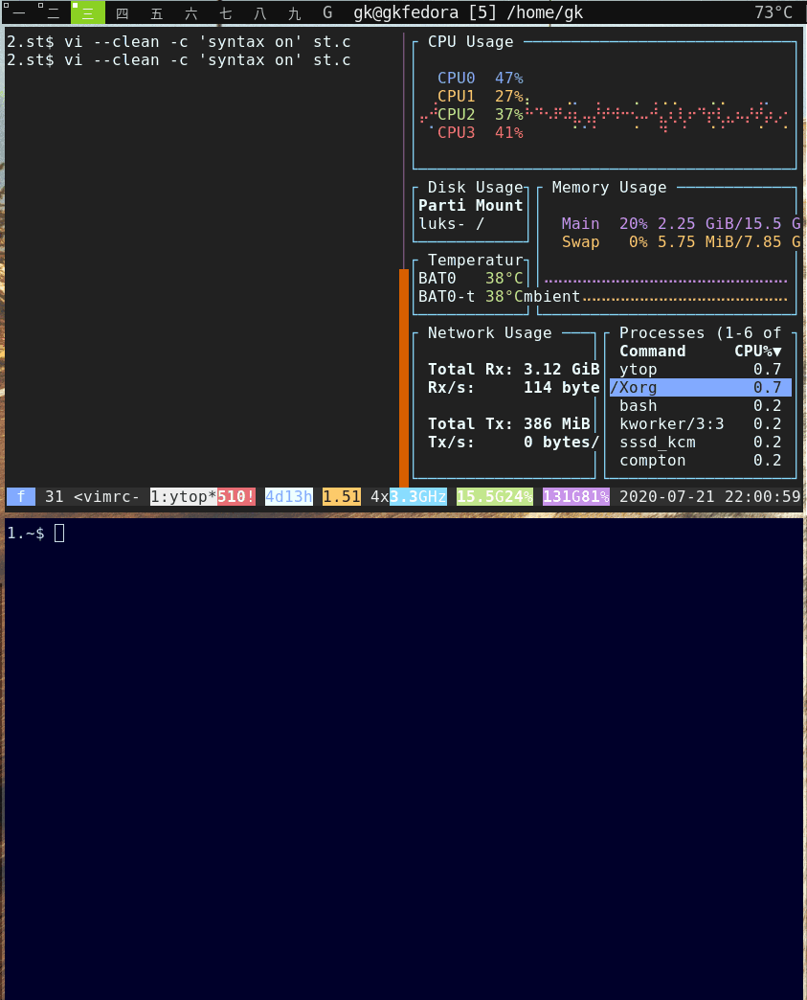

# Colors

Colors are the most important expressive possibility we have, especially in the terminal.

mdv offers a lot of possibilities to parametrize coloring, but there are some basic things to
know.

!!! tip "Terminal Colors"
    There [lots of good resources][TC] about terminal colors out there, so we only provide the minimum
    information here how terminals render colors.

[Here](./ansi.md) is a very concise description about the base mechanics.

## System Colors

What many tutorials miss, is to explain the difference between system colors ("8-16 base colors") and fixed colors. 

Many users love the terminal because of [consistent looks][porn] between apps. There are even
[applications](https://github.com/dylanaraps/pywal), which can set the looks cross-app, consistent
with the dominant colors of your current wallpaper...

[porn]: https://www.reddit.com/search/?q=dwm%20rice

How can this work.

Answer (like for any problem in software): An indirection.

Much like UI toolkits like gtk and qt, the terminal world also offers cross-app theming mechanics.

!!! important
    === "System Colors"

        There is a special set of 16 "base" or "system" color ANSI codes, where most terminals offer an
        app independent system wide *indirection feature*, through which the user can configure, which
        *actual* color the terminal should use. Escape sequence for those: `\x1b[<30-37>m` (3/4 bit) and
        `\x1b[38;5;<0-15>m` (for background: 40-47 and 48;5;...). See [here](./ansi.md).


        > **In the terminal world you do not theme the apps. Rather you theme the system.**
    
    === "Example: htop and vim"
        Illustration of consistent style between terminal apps, while changing the terminal config
        for system color mappings. 

        


## True Colors: Expressive Freedom / Deterministic Output

!!! note "True Colors Are Fixed"

    Using true colors is comparable to the web: The author defines how the content should look,
    colorwise and that's what the user gets - with the exception of the recently popular dark/light
    mode support of many web pages, or artifical, [more or less](https://darkreader.org/) awkward
    ways of applying personal styles to content, after the fact.

Users of mdv most probably run a true color capable (24-bit color) terminal. [Most]() terminals today
support this. 

Quick Test: 


<xterm />

    $ mdv2 colortables --max=30
    
    
    24 Bit (Web) Colors                                                             
    CSS e.g. {color: rgb(255, 0, 0)} or #F00 or hsl() or name...
    aliceblue           antiquewhite        aqua                aquamarine          
                                                                                    
    azure               beige               bisque              black               
                                                                                    
    blanchedalmond      blue                blueviolet          brown               
                                                                                    
    burlywood           cadetblue           chartreuse          chocolate           
                                                                                    
    coral               cornflowerblue      cornsilk            crimson             
                                                                                    
    cyan                darkblue            darkcyan            darkgoldenrod       
                                                                                    
    darkgray            darkgreen           darkgrey            darkkhaki           
                                                                                    
    darkmagenta         darkolivegreen      
                                            
    (117 more colors)
    
    8 Bit Colors Absolute                                                           
    Config: color_table_256_true, then CSS: e.g. {color: ansi(9)})
    black            maroon           green            olive            
                                                                        
    navy             purple           teal             silver           
                                                                        
    grey             red              lime             yellow           
                                                                        
    blue             fuchsia          aqua             white            
                                                                        
    grey0            navyblue         darkblue         blue3            
                                                                        
    blue1            darkgreen        deepskyblue4     dodgerblue3      
                                                                        
    dodgerblue2      green4           springgreen4     turquoise4       
                                                                        
    deepskyblue3     dodgerblue1      
                                      
    (171 more colors)
    
    8 Bit Colors, 0-15 Themable                                                     
    CSS: {color: ansi(<0-255>)}
    black            maroon           green            olive            
                                                                        
    navy             purple           teal             silver           
                                                                        
    grey             red              lime             yellow           
                                                                        
    blue             fuchsia          aqua             white            
                                                                        
    grey0            navyblue         darkblue         blue3            
                                                                        
    blue1            darkgreen        deepskyblue4     dodgerblue3      
                                                                        
    dodgerblue2      green4           springgreen4     turquoise4       
                                                                        
    deepskyblue3     dodgerblue1      
                                      
    (171 more colors)
    
    3/4 Bit Colors                                                                  
    CSS: {color: ansi("<30-37>")}
    30   31   32   33   34   35   36   37   
                                           


If you get output like above you are good. Now you need to know about Base16, the 16 base colors.


## Base16: Consistency

Here the output of the `mdv2 colortables` command again - while changing the terminal base16 color
mapping configuration, using a little [tool](https://github.com/axiros/suckless-add-ons),
which allows to select [base16 themes][b16], then changes the terminal config and sig-reloads the terminal.

You notice that the 16 base colors change, while the other colors remain fixed (except the text,
which is usually set to be a base color).


!!! note "System Colors Should Be Default"

    "Use the 16 System (Base) Colors as Default When Shipping Apps"

    Terminal application authors are encouraged to default to using those 16 base
    colors, when generating output - and NOT the other 8 bit or 24-bit (true) colors - so to allow the
    user to configure cross-app consistent color themes.

    > If every terminal application defaulted to the author's fixed color preferences, we would get the
    same stylisitic mess than in the web.

    The [base16 suite][b16] provides styling guidelines and
    a ton of themes, i.e. actual color mappings, for the 16 base color codes.

Having said that, there are valid exceptions to using system colors, i.e. reasons to use fixed colors:

- Terminal based Presentations 
- Getting visually distinct output
- Compliance with CI rules 
- (...)


## mdv's CSS Color Functions

In stylesheets you can express the foreground and background colors of text and borders. I.e. you have:

- `{color: <C>}`
- `{background-color: <C>}`
- `{border: 1em solid <C>}` or `{border-<direction>-color: <C>}`

where `<C>` can be (with examples):

- For **fixed colors**:
    - a hex code (e.g. `#FF0000`)
    - a css color function
        - rgb(255, 0, 0)
        - hsl(50, 100%, 100%) (also: hls)
        - hsv(50, 50%, 50%) 
        - yiq(#ff0000)
        - ansi(<16-255>)  (below 16 we have the system colors), mapped to \x1b[38;5;<nr>m`

- For **system colors**:
    - ansi(6), ansi(1, 4, 38, 5, 6) (which would not only define to use foreground base color 6 but also [set](./ansi.md) underline and bold (4 and 1) 
    - mdv uses by default themable system colors, when you specify their [standarized](<{config.repo_url}>src/mdv/plugins/color_table_256.py) names. You can switch this to using true colors by setting `colors_256` to "color_table_256_true".

The `ansi` function is not a standard css function - you can provide any [ANSI](./ansi.md) sequence
here.

!!! tip "Media Queries: `only tty`"
    You can use the `only tty` media query to have your CSS compliant for browsers and mdv, using
    the ansi function only within `only tty` sections of your CSS.


## Troubleshooting
### Windows

We currently have not possibility to test mdv on windows and are not sure about the state of ANSI
support there. But: At mdv startup, when we detect we are on windows we try:

```python
import colorama;
colorama.init()
```

This intercepts sys.stdout and maps ANSI Escape codes to windows compliant control sequences.

!!! important "Windows Support"
    pip install colorama and use only supported (coloroma mapped or natively supported) colors in
    mdv.


## Further Reading

(many taken from: [pastel][P])

Interesting Software:

* [pastel](https://github.com/sharkdp/pastel)

Interesting Wikipedia pages:

* [Color difference](https://en.wikipedia.org/wiki/Color_difference)
* [CIE 1931 color space](https://en.wikipedia.org/wiki/CIE_1931_color_space)
* [CIELAB color space](https://en.wikipedia.org/wiki/CIELAB_color_space)
* [Line of purples](https://en.wikipedia.org/wiki/Line_of_purples)
* [Impossible color](https://en.wikipedia.org/wiki/Impossible_color)
* [sRGB](https://en.wikipedia.org/wiki/SRGB)
* [Color theory](https://en.wikipedia.org/wiki/Color_theory)
* [Eigengrau](https://en.wikipedia.org/wiki/Eigengrau)

Color names:

* [XKCD Color Survey Results](https://blog.xkcd.com/2010/05/03/color-survey-results/)
* [Peachpuffs and Lemonchiffons - talk about named colors](https://www.youtube.com/watch?v=HmStJQzclHc)
* [List of CSS color keywords](https://www.w3.org/TR/SVG11/types.html#ColorKeywords)

Maximally distinct colors:

* [How to automatically generate N "distinct" colors?](https://stackoverflow.com/q/470690/704831)
* [Publication on two algorithms to generate (maximally) distinct colors](http://citeseerx.ist.psu.edu/viewdoc/summary?doi=10.1.1.65.2790)

Other articles and videos:

* [Color Matching](https://www.youtube.com/watch?v=82ItpxqPP4I)
* [Introduction to color spaces](https://ciechanow.ski/color-spaces/)

[TC]: https://www.google.com/search?q=terminal+colors
[P]: https://github.com/sharkdp/pastel
[AE]: https://en.wikipedia.org/wiki/ANSI_escape_code
[b16]: http://chriskempson.com/projects/base16/